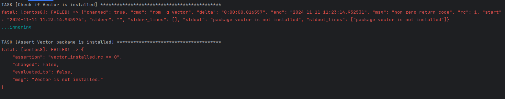

Для воспроизведения ошибки:
## Подготовка проекта
#### Создать виртуальную среду
`python3 -m venv venv`
#### Активировать виртуальную среду
`source venv/bin/activate`
#### Установить зависимости
`pip install -r requirements.txt`
## Запуск ansible playbook
#### Если контейнер с именем centos8 есть, то остановить и удалить его
`docker stop centos8`  
`docker rm centos8`  
#### Перейти в директорию `centos_test`
`cd centos_test`  
#### Создать и запустить контейнер
`docker build -t centos8 - < Dockerfile.centos8`  
`docker run -d --name centos8 centos8`
#### Запустить playbook
`ansible-playbook -i containers.yml playbook.yml`
#### Проверить, что в контейнере установлен vector
`docker exec -it centos8 /bin/bash`
###### Внутри контейнера
`vector --version`  должен выдать номер версии, например:  
```commandline
vector 0.42.0 (x86_64-unknown-linux-gnu 3d16e34 2024-10-21 14:10:14.375255220)
```
#### Убедиться, что скачанный скрипт существует
`ls -la /root/install_vector*`
#### Выйти из контейнера  
`exit`  
#### Удалить контейнер
`docker stop centos8 && docker rm centos8`

---

*Убедились, что в контейнере vector установлен*

---

## Запуск теста
#### Перейти в директорию 'Ansible_vector_role'
`cd ../Ansible_vector_role`
#### Запустить тест
`molecule test -s default --destroy never`
В ходе выполнения видим такой лог:  

#### Заходим в контейнер
`docker exec -it centos8 /bin/bash`
#### Проверяем наличие файла `install_vector.sh`
`ls -la /root`

---

*Убедились, что файла нет, хотя task мы делали c include, это те же самые tasks, что и в playbook без molecule.*  

*Vector НЕ установлен*

---
