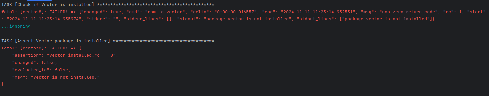

[Задание](https://github.com/netology-code/mnt-homeworks/tree/MNT-video/08-ansible-05-testing)

Подготавливаем виртуальное окружение, иначе не ставится molecule:  
`python3 -m venv venv`  
`pip3 install ansible-dev-tools`  
Проблемы с запуском, сваливается с ошибкой, решение нашёл [здесь](https://stackoverflow.com/questions/76135904/molecule-5-0-0-docker-driver-fails)  
После выполнения этих команд:
```commandline
pip uninstall docker
pip uninstall docker-py
pip install molecule-plugins[docker]
```
проблема исчезла.

Клонируем роль:  
`git clone git@github.com:AlexeySetevoi/ansible-clickhouse.git`  
Запускаем   
`molecule test -s ubuntu_xenial`
Тестирование выдало ошибку:    
  
Но в целом тесты завершились успешно:  
  

Тестируем vector role:
`molecule init scenario --driver-name docker`

образ oraclelinux, похоже, не найден:  


Остальные прошли успешно:


Добавляем [verify.yml](Ansible_vector_role/molecule/default/verify.yml)

Тут начинается интересное, отчего появляются вопросы.
1. В контейнере centos8 не срабатывает yum (update, install), ответ нашёл тут:  
https://stackoverflow.com/questions/71047110/we-cant-install-yum-update-on-centos  
Если я этот код ставлю в prepare.yml или в playbook, он тоже не срабатывает, ansible ругается.  
Собственно, это и была основная причина того, что я стал собирать playbook на образе almalinux, там таких проблем не возникало.
Поэтому пришлось готовить свой образ [Dockerfile](Ansible_vector_role/molecule/default/Dockerfile.centos8), который бы заранее, до ansible, запускал эти команды, плюс установка python и sudo, без которых тоже были проблемы с ansible.

Теперь, собственно, вопрос:
Это решение мне кажется "костыльным", если это так, то есть ли верное решение этой проблемы? Ну или более корректное, чем сборка образа с этими командами?

Был соблазн "слямзить" решение в [github](https://github.com/Kratomik/devops28-netology/blob/main/ansible/08-ansible-05-testing/08-ansible-04-role/playbook/roles/vector-role/tasks/main.yml), но мне там не понравилось то, что есть привязка к версии, хотелось именно заставить работать удалённый скрипт от vector (https://sh.vector.dev), тем более, если такая проблема встретится уже в работе, то было бы неплохо иметь правильное решение.

2. Когда уже всё вроде заработало, столкнулся с разницей между реальным запуском и тестированием. В реальном запуске vector ставится, при тестировании с molecule НЕ ставится. Таска идентичная, образ тот же самый. Можно увидеть это так:
##### Для playbook:
- Готовим образ: в директории [centos_test](centos_test) запускаем:
- `docker build -t centos8 - < Dockerfile.centos8`  
- `docker run -d --name centos8 centos8`  
- Контейнер запущен, запускаем `ansible-playbook -i containers.yml playbook.yml`  
- Заходим в контейнер `docker exec -it centos8 /bin/bash`
- проверяем `vector --version` - видим, что он установлен

#### Для теста:
- В директории [Ansible_vector_role](Ansible_vector_role) запускаем:
- `molecule test --destroy never`
- При прохождении [verify.yml](Ansible_vector_role/molecule/default/verify.yml) видим, что vector не установлен
- Проверяем "ручками", заходим в контейнер `docker exec -it centos8 /bin/bash`
- Запускаеми `vector --version` - видим, что он НЕ установлен

Вопросы:
- Почему при всех равных условиях (образ, первая таска) в playbook срабатывает, а в molecule не срабатывает?
- Как сделать правильно, чтобы таска срабатывала в molecule?
- Почему, если есть таски, которые НЕ срабатывают, финальный ответ от molecule не показывает failed?
- Чтобы увидеть ошибки, нужно пролистать весь ответ molecule, ошибка будет где-то в середине, так и должно быть? 
